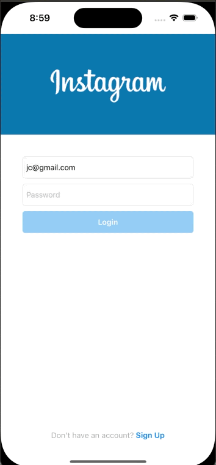
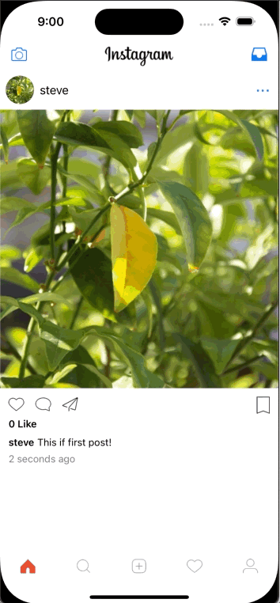
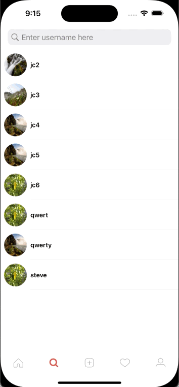
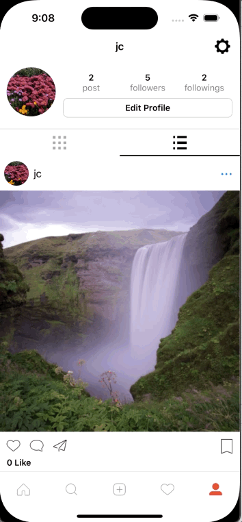

<h1>Introduction</h1>

An instagram clone app made with swift uikit and postgresql for database

<h2>Register And Login Screen</h2>
 
<h2>Sharing Feed Screen</h2>
 
<h2>HomeViewController Screen</h2>
 
<h2>SearchViewController screen</h2>
 
<h2>ProfileViewController Screen</h2>
 
<h2>Sign Out Screen</h2>
 
